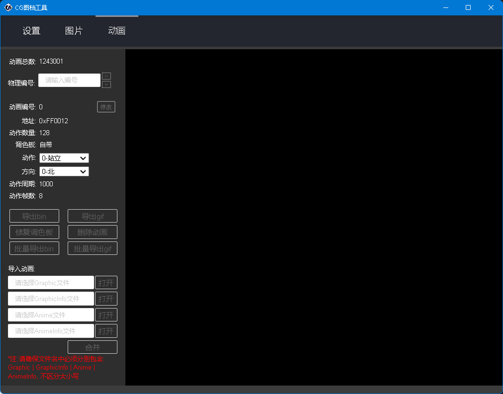

# CrossGate Bin Tool GUI
<烂尾中, 对于动辄10w+条数据, electron进程间通信消耗巨大, 且前端页面渲染压力同样巨大>




### 使用方法:

1. 开发模式
```
npm start --enable-logging
```

2. 构建app(注:不要用cnpm)
```
npm install
npm run make -- --arch="ia32,x64"
```

### 压缩:
1. https://www.zhihu.com/question/380942381/answer/2898106802?utm_id=0

2. https://newsn.net/say/electron-exe-upx.html